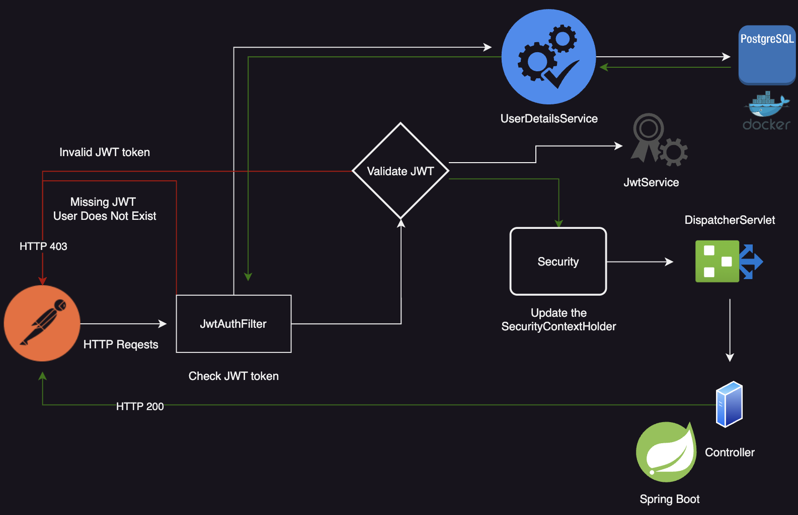

# Spring Boot 3.0 Security with JWT

## Introduction
The purpose of the project is to practice securing a Spring Boot application using JSON Web Tokens (JWT)

## Application Architecture

## Technologies
* Spring Boot 3.0
* Spring Security
* JSON Web Token (JWT)
* BCrypt
* Gradle

